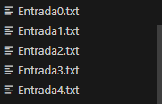
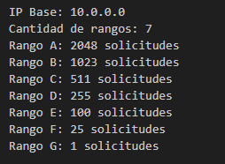
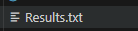
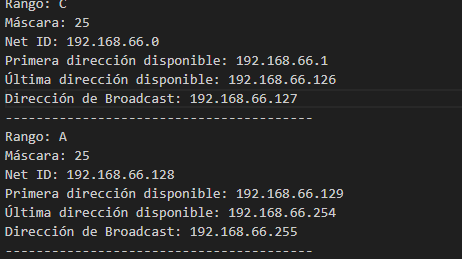

# Tarea Redes Subnetting Diego Cerdas Delgado C21988

# Manual de uso

## Esta carpeta contiene una serie de archivos que permiten asignar direcciones IP disponibles a una serie de rangos de dos dos formas posibles:

# Tipos de Asignación

# Asignación de Arriba hacia Abajo (Upper to Lower)

## En este método, las direcciones se asignan comenzando por las direcciones más altas del rango disponible.

# Asignación de Abajo hacia Arriba (Lower to Upper)

# En este método, las direcciones se asignan comenzando por las direcciones más altas del rango disponible.

# Interfaz de usuario

## Este código contiene un menú donde el usuario decide cuál archivo de los casos de prueba desea seleccionar y el tipo de asignación que desea realizar, el usuario puede modificar estos casos propuestos o añadir otros nuevos casos siempre y cuando respete el formato empleado en los casos originales.




## Los resultados se almacenan dentro del archivo Results.txt luego de cada prueba, el usuario debe de abrir este archivo para visualizar el resultado.



# Posible Salida:



# Requisitos

- Compilador compatible con C++17 (por ejemplo, `g++`)
- Sistema compatible con Make (Linux, macOS o Windows con MinGW/MSYS)

# Ejemplo de compilación

## Puedes compilar el proyecto utilizando el comando:

```bash
make
```

# Ejemplo de ejecución

```bash
make run
```


